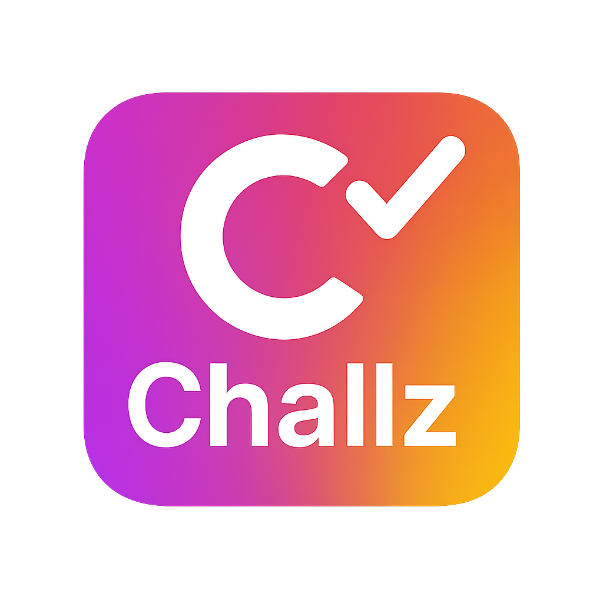

  

# Challz

Challz es una plataforma moderna de retos sociales tipo TikTok, construida con Next.js, Firebase y desplegada fácilmente en Vercel.

---

## 🚀 Características principales

- Autenticación y registro seguros con Firebase Auth
- Feed dinámico de videos y retos
- Subida y gestión de contenido multimedia
- Interfaz moderna y adaptable a dispositivos móviles

## 🛠 Instalación y configuración

### 1. Clona el repositorio

git clone https://github.com/tuusuario/challz.git
cd challz

### 2. Instala las dependencias

npm install

text
### 3. Crea tu archivo de variables de entorno

Copia el ejemplo y añade tus propias claves de Firebase:

cp .env.example .env.local

Rellena los valores reales en `.env.local` según tu proyecto de Firebase.

### 4. Inicia el entorno de desarrollo

npm run dev

Abre `http://localhost:3000` en tu navegador para ver la app en acción.

---

## 🔑 Variables de entorno

Copia los nombres de `.env.example` y colócalos en tu `.env.local`:

NEXT_PUBLIC_FIREBASE_API_KEY=your_api_key_here
NEXT_PUBLIC_FIREBASE_AUTH_DOMAIN=your_auth_domain_here
NEXT_PUBLIC_FIREBASE_PROJECT_ID=your_project_id_here
NEXT_PUBLIC_FIREBASE_STORAGE_BUCKET=your_storage_bucket_here
NEXT_PUBLIC_FIREBASE_MESSAGING_SENDER_ID=your_sender_id_here
NEXT_PUBLIC_FIREBASE_APP_ID=your_app_id_here

**Importante:**  
No incluyas datos reales en `.env.example`. Solo tus colaboradores deben agregar datos reales en `.env.local` (que no debe subirse al repositorio).

---

## 🌐 Despliegue en producción

Este proyecto está preparado para desplegarse en [Vercel](https://vercel.com/):

1. Sube tu repositorio a GitHub.
2. Importa el proyecto en Vercel y configura las mismas variables de entorno del `.env.local` en el panel de Vercel.
3. ¡Listo! Tu app estará visible en la URL de Vercel.

---

## 📂 Estructura básica del proyecto

- `/pages` — Rutas y páginas principales de la app (Next.js)
- `/components` — Componentes reutilizables de UI
- `/lib` — Lógica de conexión a Firebase y utilidades
- `/public` — Archivos estáticos, imágenes y logo

---

## 👥 Créditos y agradecimientos

Desarrollado por **Ivan R. Betancourt**  
Correo: [ivanrba0193@gmail.com](mailto:ivanrba0193@gmail.com)

Tecnologías usadas:
- [Next.js](https://nextjs.org/)
- [Firebase](https://firebase.google.com/)
- [Vercel](https://vercel.com/)

---

## 📝 Contribuciones

¿Te gustaría colaborar o proponer mejoras?  
- Haz un fork del repositorio
- Crea una nueva rama (`git checkout -b feature/nueva-funcionalidad`)
- Haz tus cambios y envía tu Pull Request

---

## 📢 Contacto

Para dudas, reportes de bugs o sugerencias, escribe a [ivanrba0193@gmail.com](mailto:ivanrba0193@gmail.com).

---

  <strong>¡Gracias por usar Challz!</strong>

